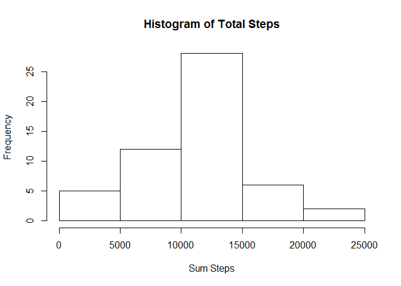
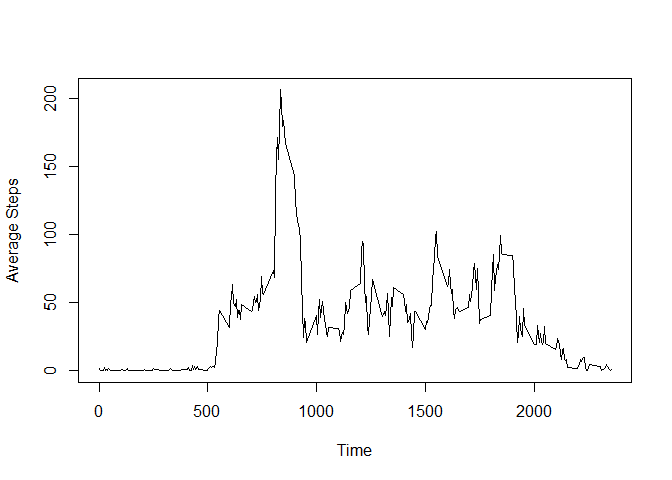
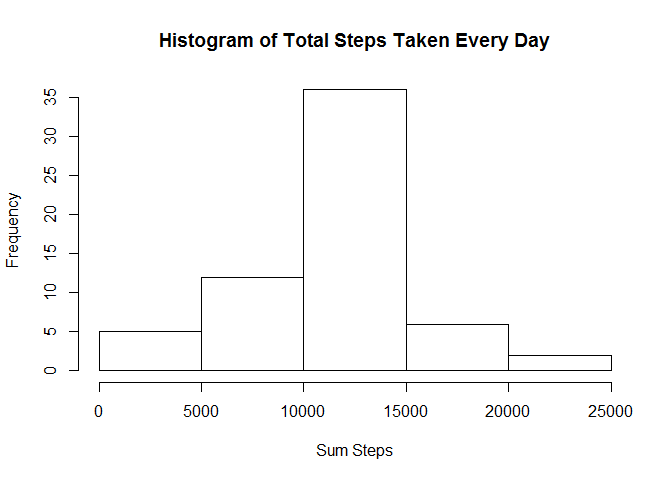
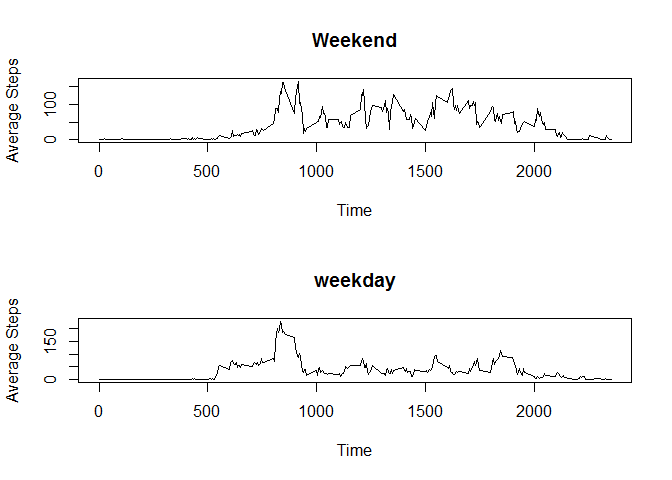

# Reproducible Research: Peer Assessment 1


## Loading and preprocessing the data

```r
rawdata <- read.csv("activity.csv", header = TRUE)
```


## What is mean total number of steps taken per day?

1. Calculate the total number of steps taken per day

```r
library(lubridate)
library(dplyr)
```

```
## 
## Attaching package: 'dplyr'
## 
## The following objects are masked from 'package:lubridate':
## 
##     intersect, setdiff, union
## 
## The following object is masked from 'package:stats':
## 
##     filter
## 
## The following objects are masked from 'package:base':
## 
##     intersect, setdiff, setequal, union
```

```r
rawdata <- mutate(rawdata, date = ymd(date))
data <- filter(rawdata, !(is.na(steps)))
data <- group_by(data, date)
sumsteps <- summarize(data, sum = sum(steps, na.rm = TRUE))
print(sumsteps)
```

```
## Source: local data frame [53 x 2]
## 
##          date   sum
## 1  2012-10-02   126
## 2  2012-10-03 11352
## 3  2012-10-04 12116
## 4  2012-10-05 13294
## 5  2012-10-06 15420
## 6  2012-10-07 11015
## 7  2012-10-09 12811
## 8  2012-10-10  9900
## 9  2012-10-11 10304
## 10 2012-10-12 17382
## ..        ...   ...
```

2. Make a histogram of the total number of steps taken each day

```r
hist(sumsteps$sum, xlab = "Sum Steps", main = "Histogram of Total Steps")
```

 

3. Calculate and report the mean and median of the total number of steps taken per day


```r
summarize(data, mean = mean(steps, na.rm = TRUE), median = median(steps, na.rm = TRUE))
```

```
## Source: local data frame [53 x 3]
## 
##          date     mean median
## 1  2012-10-02  0.43750      0
## 2  2012-10-03 39.41667      0
## 3  2012-10-04 42.06944      0
## 4  2012-10-05 46.15972      0
## 5  2012-10-06 53.54167      0
## 6  2012-10-07 38.24653      0
## 7  2012-10-09 44.48264      0
## 8  2012-10-10 34.37500      0
## 9  2012-10-11 35.77778      0
## 10 2012-10-12 60.35417      0
## ..        ...      ...    ...
```

## What is the average daily activity pattern?
1. Make a time series plot

```r
data <- group_by(rawdata, interval)
data <- summarize(data, mean = mean(steps, na.rm = TRUE))
with(data, plot(interval, mean, type = "l", xlab = "Time", ylab = "Average Steps"))
```

 

2. Which 5-minute interval contains the maximum number of steps?

```r
data$interval[which.max(data$mean)]
```

```
## [1] 835
```

## Imputing missing values

1. Calculate and report the total number of missing values in the dataset

```r
data <- rawdata
sum(!is.na(data$steps))
```

```
## [1] 15264
```
2. Filling in all of the missing values using the mean for that 5-minute interval

```r
data <- group_by(rawdata, interval)
meansteps <- summarize(data, mean = mean(steps, na.rm = TRUE))
days <- length(unique(data$date))
meansteps <- rep(meansteps$mean, days)
data[is.na(data$steps), 1] <- floor(meansteps[is.na(data$steps)])
print(data)
```

```
## Source: local data frame [17,568 x 3]
## Groups: interval
## 
##    steps       date interval
## 1      1 2012-10-01        0
## 2      0 2012-10-01        5
## 3      0 2012-10-01       10
## 4      0 2012-10-01       15
## 5      0 2012-10-01       20
## 6      2 2012-10-01       25
## 7      0 2012-10-01       30
## 8      0 2012-10-01       35
## 9      0 2012-10-01       40
## 10     1 2012-10-01       45
## ..   ...        ...      ...
```
3. Make a histogram and report the mean and median total number of steps taken per day

```r
data <- group_by(data, date)
sumsteps <- summarize(data, sum = sum(steps, na.rm = TRUE))
hist(sumsteps$sum, xlab = "Sum Steps", main = "Histogram of Total Steps Taken Every Day")
```

 

```r
meantotalsteps <- mean(sumsteps$sum)
mediantotalsteps <- median(sumsteps$sum)
print(meantotalsteps)
```

```
## [1] 10749.77
```

```r
print(mediantotalsteps)
```

```
## [1] 10641
```
## Are there differences in activity patterns between weekdays and weekends?
1. Create a new factor variable in the dataset with two levels

```r
data <- mutate(data, week = ifelse(wday(date) == 7 | wday(date) == 1, "weekend", "weekday"))
data$week <- as.factor(data$week)
```

2. Make a panel plot containing a time series plot 

```r
weekdays <- filter(data, week == "weekday")
weekdays <- group_by(weekdays, interval)
weekdays <- summarize(weekdays, mean = mean(steps))
weekends <- filter(data, week == "weekend")
weekends <- group_by(weekends, interval)
weekends <- summarize(weekends, mean = mean(steps))
par(mfrow = c(2,1))
with(weekends, plot(interval, mean, type = "l", xlab = "Time", ylab = "Average Steps", main = "Weekend"))
with(weekdays, plot(interval, mean, type = "l", xlab = "Time", ylab = "Average Steps", main = "weekday"))
```

 
